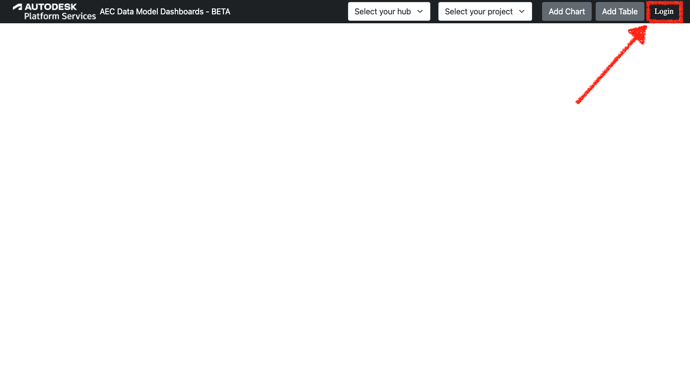
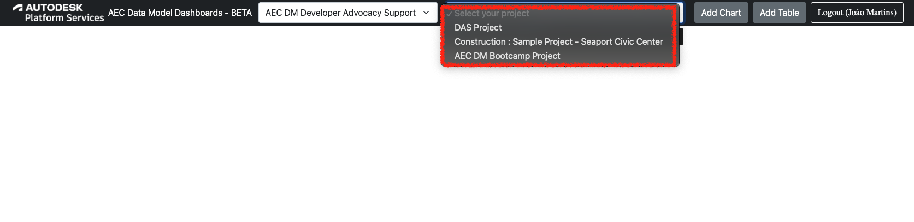
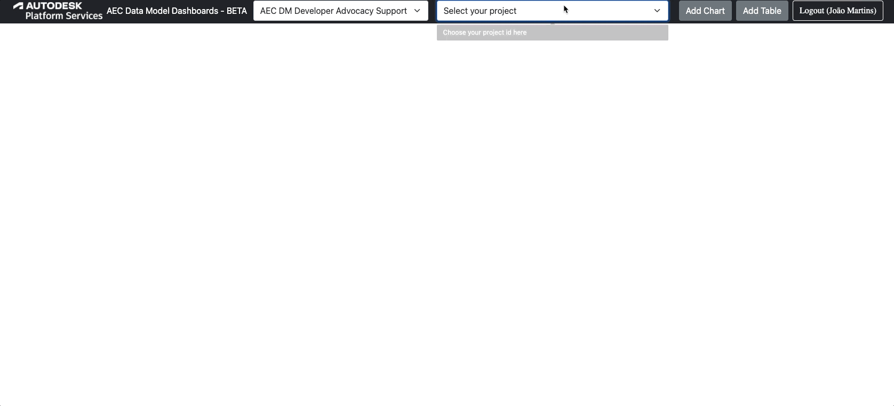
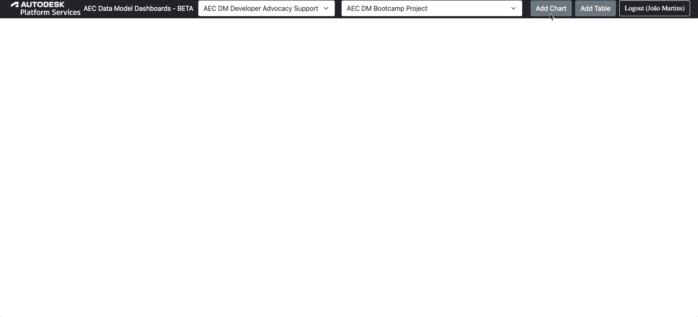

# AEC Data Model Dashboards

This sample integrates AEC Data Model API with [Tabulator](https://tabulator.info) and [Chart.js](https://www.chartjs.org) to generate tables and charts based on your AEC data.

## Setting up the app

- clone this repository or download
- restore the packages
- replace the variable values at appsettings.Development.json with your own

```json
{
  "APS_CLIENT_ID": "YOUR CLIENT ID",
  "APS_CLIENT_SECRET": "YOUR CLIENT SECRET",
  "APS_CALLBACK_URL": "http://localhost:8080/api/auth/callback"
}
```

**Make sure your APS app also uses the same callback url!**

## Running the app

As instructed in the console, you'll need to open a web browser and navigate to http://localhost:8080 in order to log into your Autodesk account



## Output

Once you logged in with your Autodesk account in the browser, your hubs provisioned should be available in the first dropdown, and as soon as you pick one, it should populate the second dropdown with the projects inside.



After selecting one project, the sample will trigger the process to show the default dashboard is rendered, just like the gif below:



Apart from these default dashboard you can add your custom charts and tables based on element filters, just like in the gif below



---

## Tips & Tricks

1. **You need to be logged in order to use any feature in this sample.**
2. **The queries performed by the sample are always posted in the console. Check them out as a good learning resource.**
